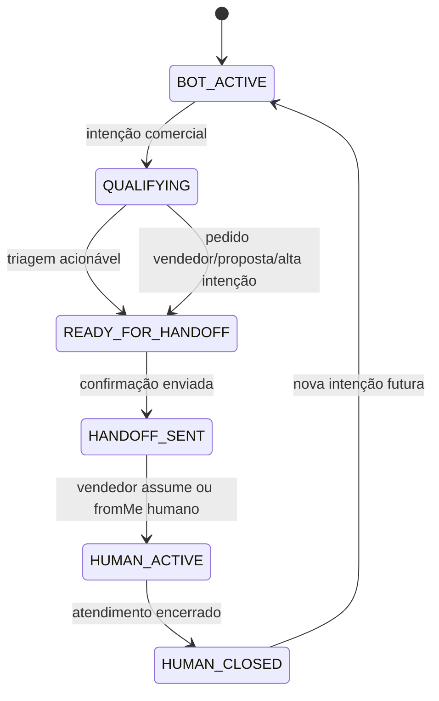
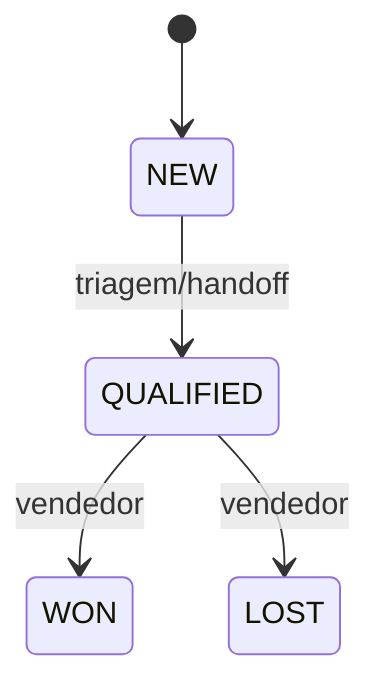

# 06 — State Machine

## Princípio
Estado é determinístico. LLM não controla lifecycle.

## Lead

## Regras
- `HANDOFF_SENT` permite exatamente uma mensagem automática.
- `HUMAN_ACTIVE` proíbe IA.
- Conversation incompleta e Lead NEW não expiram automaticamente no MVP.
