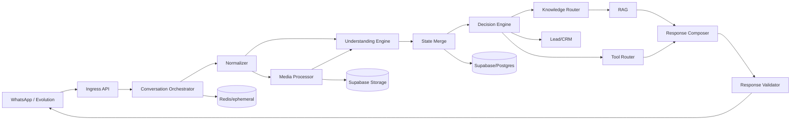

# 09 — Architecture

## Diretriz
Não portar n8n nó por nó. Extrair regras, intents, lifecycle, tools, multimodal, RAG, handoff e safeguards.

## Componentes
- FastAPI para ingress/API interna.
- Worker Python para processamento.
- Redis somente para lock, idempotência, debounce e cache efêmero.
- Supabase/PostgreSQL como fonte de verdade.
- Understanding Engine produz `TurnFacts`.
- Decision Engine é determinístico.
- Response Composer usa LLM somente para linguagem.

## Temporal
Não obrigatório no MVP. Começar simples com worker Python + Redis/DB. Introduzir orquestrador durável apenas se a complexidade futura justificar.

## Concorrência
Lock por thread/telefone, um processamento ativo por thread, idempotência por provider message ID e `fromMe` humano sempre vence IA.

## Debounce
Janela configurável curta, não copiar mecanicamente wait de 7s do n8n.

## Monorepo
Preferência `apps/sdr`, pendente preflight de impacto na Vercel.
